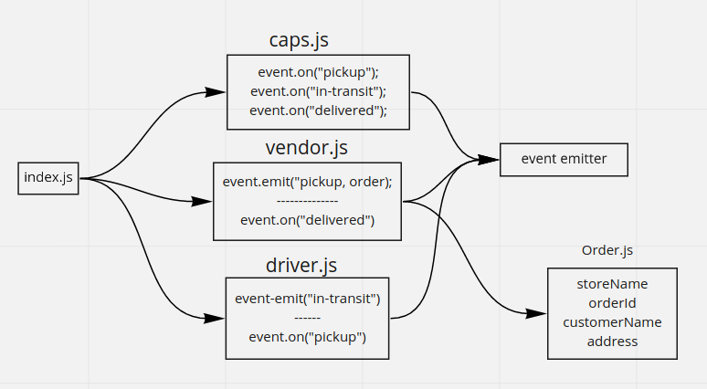

### **.env**
```env
STORE_NAME=adnan
```
## UML


<a name="Order"></a>

## Order
**Kind**: global class  
**Properties**

| Name |
| --- |
| storeName |
| orderId |
| customerName |
| address |


### package.json scripts
#### start
```sh
npm start # node index.js
```
#### dev
```sh
npm run dev # nodemon index.js
```
#### test
```sh
npm test # jest --coverage --verbose
```
#### lint
```sh
npm run lint # eslint './**/*.js' --ignore-pattern node_modules/
```
